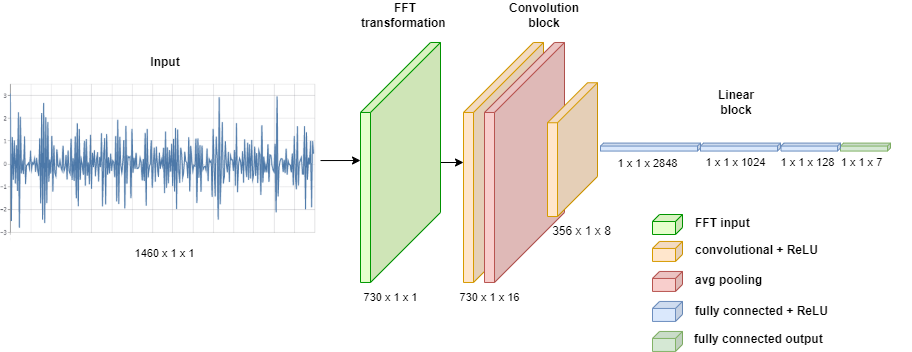
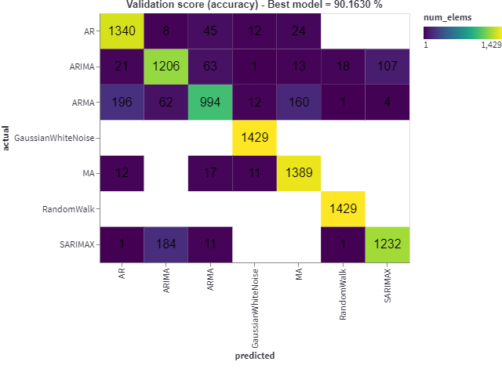

## Automated forecasting method recommendation demo

This project was developed in the scope of a bachelor thesis 
and contains [streamlit](https://streamlit.io/) apps for showcases.

Using this project, we developed a convolutional neural network 
on top of a fast Fourier transform of time series data to classify 
them into the subfamilies of the ARIMA stochastic processes, i.e.,
* Gaussian white noise (ARIMA(0,0,0))
* Random walk (ARIMA(0,1,0))
* AR(p) with 1 ≤ p ≤ 5
* MA(q) with 1 ≤ q ≤ 5
* ARMA(p,q) with 1 ≤ p ≤ 5, 1 ≤ q ≤ 5
* ARIMA(p,d,q) with 1 ≤ p ≤ 5, 1 ≤ q ≤ 5, 1 ≤ d ≤ 2
* SARIMA(p,d,q)(P,D,Q)s with 1 ≤ p ≤ 5, 1 ≤ q ≤ 5, 1 ≤ d ≤ 2,
  1 ≤ P ≤ 2, 1 ≤ Q ≤ 2, 0 ≤ D ≤ 1, s = 7 or s = 14

The motivation behind this classification is to provide a forecasting 
method recommendation framework that narrows down the search space 
for the model order of ARIMA processes and also gives insights 
into the characteristics of timeseries such as autoregressivity 
or seasonality.

The image below shows an overview of the classifier architecture.


Our best results can be seen below.


A more formal description of the project and architecture can be found in the [thesis](#todo).

## Requirements

Python 3.7 or later with all dependencies installed.
Installation instructions for Python can be found [here](https://wiki.python.org/moin/BeginnersGuide/Download).
We advise [pip](https://pip.pypa.io/en/stable/installation/) or [conda](https://docs.conda.io/projects/conda/en/latest/user-guide/install/index.html) as the package manager to install the required dependencies.
We provide a `requirements.txt` or `environment.yml` for installation 
with pip or conda respectively. 

To install the dependencies with pip, run the following in the command line.
```bash
pip install -r requirements.txt
```

To install the dependencies with conda, run the following in the command line.
```bash
conda env create -f environment.yml
```
**Remark**: If you use conda, make sure to activate the environment whenever 
you want to run the streamlit application, i.e.,
```bash
conda activate forecasting_method_recommendation
```

## Running the application
The project has been implemented as a streamlit demo.
In the root folder, one can run it with the following command.
```bash
streamlit run demo.py
```
A browser window will be opened automatically with the demo app running.

The sidebar is present on all pages and allows navigation between pages and changing the seed for the random number generator.

The code for the demo pages is located in &lt;projectRoot>\ui.

## Applications

We have developed 5 different streamlit applications.

### Simulation demo
The simulation UI page allows to simulate time series data and get different kinds of information for it.
One can select between different kinds of model generators and the number of samples for the simulated time series.

We can fit different kinds of models on this time series data. For each time series generator, there is also a fitting function implemented that usually takes
care of identifying the model order and uses the statsmodels library for the actual fitting of the model. The model order is identified with the same method that is outlined in Chapter \ref{ch:baseline_model}.
There are four different choices for the search space of models:
* **same hyperparameters as simulation**: The fitting procedure uses the exact same hyperparameters that were used when simulating the time series to fit a model.
This completely eliminates the model identification step, since the model order is given.
Example: If the ARGenerator simulated an AR(2) time series, then we would fit an AR(2) model on the time series.
* **same model class**: The fitting procedure of the currently selected model class is applied. This potentially involves model identification as well based on the chosen model class.
Example: If ARGenerator simulated an AR(2) time series, then we would search amongst AR(p) models with p one of 1,2,3,4,5 and choosing the best fit according to the given evaluation criterion.
* **any model class**: We use the baseline model to search amongst the given model classes with the given evaluation criteria.
* **no fit**: We don't fit any model on the simulated time series.

If we fit a model, we can see the fitted values of the best-fit model for the simulated time series in the chart of the time series in orange.
For time series models, the fitted values are one-step-ahead forecasts.

If we load a model, i.e., a classifier model that we trained, we can see the prediction of our classifier model above the chart.

Below the line chart there are also the autocorrelation and partial autocorrelation plots which are useful features for analyzing time series.
The last two sections show the parameters of the simulation and a summary of the best-fit model.

### Writing samples

This page allows to generate a given number of time series samples for given sample generators.
It's main responsibility is to store generated samples in a file and to allow analysis of those samples, e.g. to get a histogram of transformed coefficients.

### Baseline evaluation

This page allows to evaluate a baseline model for the given settings.

The batch size is only there to define when to print the current result of the baseline evaluation.
After each batch we print a confusion matrix for all predictions up to the current batch.

A confusion matrix visualizes the performance of a classification algorithm.
Each row represents the instances of actual classes and each column represents the instance of predicted classes.
We present the simplest metric, a simple count of co-occurrence for an actual and predicted class.
If our model gets an AR sample and predicts it as MA, then we would see an increase by 1 in the confusion matrix cell
for the row that represents AR and the column that represents MA. Optimally, we would only have counts greater than 0 in the diagonal,
which represents correct classifications.

We also log the cumulated accuracy in a separate line.

The number of processes defines how many Python processes should be used to parallelize the baseline evaluation, -1 means the maximum allowed amount based on the used CPU.
As the evaluation can take multiple days, we store the samples and their baseline predictions in a 'results.pickle' file in the root folder after each batch.
If this file exists when starting a baseline evaluation run, we continue from the point where we stopped last time.

### DTW evaluation

This page is a copy of baseline evaluation, but uses a K-nearest-neighbors classifier 
with the dynamic time warping metric.

### Training a model

This page allows to train the convolutional neural network that is currently defined in code.
We hardcoded it to our best-performing model, i.e., the convolutional neural network that only operates on a fast Fourier transform of time series.

When starting a training procedure, we plot the structure of the convolutional neural network.
After each epoch, we show a confusion matrix for the predictions of the model on the test set.
We also show four line charts, two concerned with the overall performance of the model and two with a per-class performance of the model.
The per-class charts allow to focus on selected classes by clicking on the class labels in the legend.